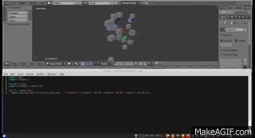

Live-coding [Blender](http://blender3d.org/) with [Hylang](http://hylang.org/).

### Running it ###

Tested on GNU/Linux.

 * Run `./install-dependencies.sh` to install the Hy-lang dependencies in a place where Blender's internal Python can find them.
 * Run `./blender-livecode.sh examples/one-hundred-cubes.hy` to start Blender watching one-hundred-cubes.hy and re-loading it whenever it changes.

